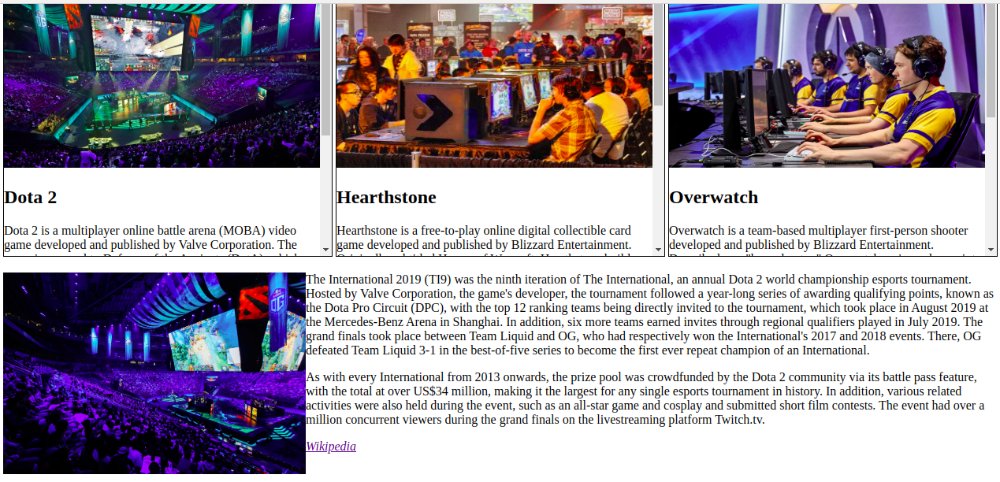

# Exercise Overview

[Contain Yourself - 30.11.20](#contain-yourself)  
[Contain Yourself - 30.11.20](#contain-yourself)  

# Contain Yourself

**Instructions**:

- Style the header so that is takes up 100% of the viewport height.
- Add the `container.jpg` image from the [images folder](./images/) to the `img` tag found in the header.
- Style the image to take up 100% width and height of the header.
- **BONUS:** Use `object-fit` to preserve the image's aspect ratio.
  
- Give the `main` element a class of `container`.
- Select the `container` class. Give it a width of 80% and center it in the middle of the page.
  
- **BONUS:** Choose a font from google fonts and apply it to the page.

## Solution:

[index.html](html/index.html)  
[style.css](css/style.css)  

[To Top](#exercise-overview)

# They see me scrolling

**Instructions**:
**Task 1**

- The sections with the class `esports-info` need to be styled.
- First of all, give each section a set height and width.
- Give each section a border.
- Set the size of the images.
- Allow the user to scroll through the information on each section.
  

**Task 2**

- Make the image and paragraphs in the section with the class `esports-tournaments` appear side-by-side using float.
  

## Solution:

[indexI.html](html/indexI.html)  
[styleI.css](css/styleI.css)  

[To Top](#exercise-overview)

