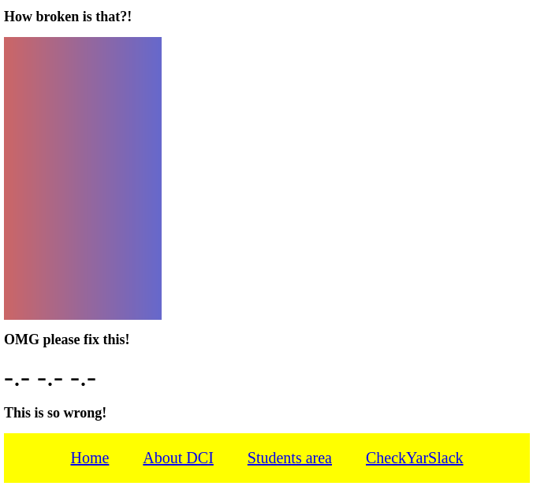
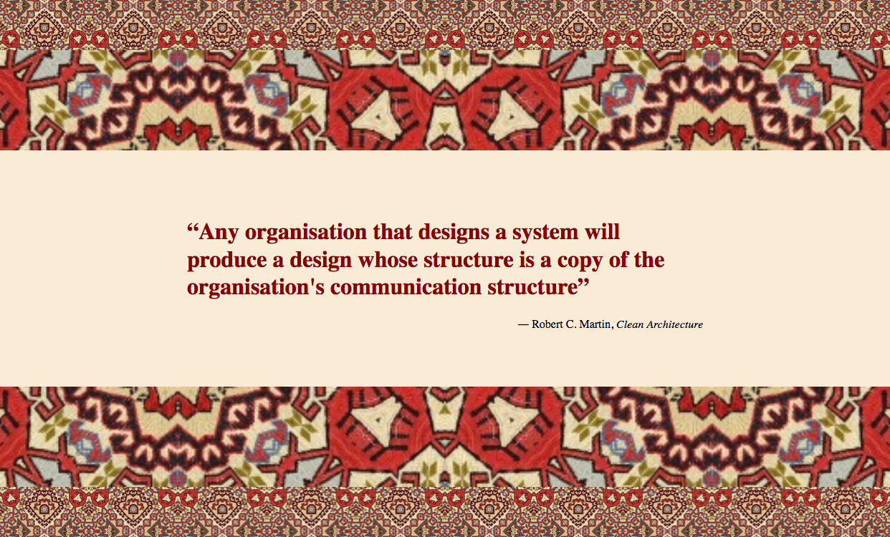

# Exercise Overview

[CSS Display Property- 1.12.20](#they-see-me-scrolling)  
[Travel Webpage- 2.12.20](#travel-webpage)  
[Background Patterns - 2.12.20](#background-patterns)  
[Breaking the flow - 3.12.20](#breaking-the-flow)  
[Stairway To Heaven - 3.12.20](#stairway-to-heaven)  
[Gradient Hero - 3.12.20](#gradient-hero)  
[UI-Basics Test - 7.12.20](#ui-basics-test-first-test)  
[Shopping List - 8.12.20](#shopping-list)  
[Text Styling & Formatting - 8.12.20](#exercise-text-styling-and-formatting)  
[Profile Card - 8.12.20](#profile-card)  
[Pseudo Element Style - 9.12.20](#pseudo-element-style)  
[Make your fonts awesome! - 9.12.20](#make-your-fonts-awesome)  
[Let the light in - 10.12.20](#elevation)  
[Table 1 - 14.12.20](#exercise-table-1)  
[Table 2 - 14.12.20](#exercise-table-2)  
[Table 3 - 14.12.20](#exercise-table-3)  
[Table 4 - 14.12.20](#exercise-table-4)  
[Styling Forms - 15.12.20](#make-your-fonts-awesome)  
[Transparent Login- 16.12.20](#transparent-login)  

## ////////////////////////////////////////////////////////////

# Exercise: CSS Display Property

**Instructions**:

1. Create a stylesheet `solution.css` and link it to the `index.html` file.
2. Add styling in order to make the page resemble the mockup image below.

## My Solution:

[index.html](html/index.html)  

## Solution:

[index.html](html/index.html)  
[style.css, 2nd part](css/style.css)  

[To Top](#exercise-overview)

# Travel Webpage

You will create a simple travel agency page with text and an image

### Design Mock-up

- You should use the `background-image` property
- As always, make your webpage pixel-perfect to the reference image
- **ABOUT** and **CONTACT** should have a heavier `font-weight` on `:hover`
- As a bonus, link other pages in the navigation

## Solution:

[indexXXIII.html](html/indexXXIII.html)  
[styleXXIII.css](css/styleXXIII.css)  

## Solution No2:

[indexI.html](html/indexI.html)  
[styleI.css](css/styleI.css)  

[To Top](#exercise-overview)

## ////////////////////////////////////////////////////////////

# Background Patterns

Let's create a simple page displaying a quote!
Two patterns surround the quote. The quotes are positioned in a certain way that the ones on the top are mirroring the one at the bottom.

Take a look at the examples:

Take a look into the [blockquote](https://developer.mozilla.org/en-US/docs/Web/HTML/Element/blockquote) element and make use of it.

## Solution:

[indexII.html](html/indexII.html)  
[styleII.css](css/styleII.css)  

[To Top](#exercise-overview)

## ////////////////////////////////////////////////////////////

# Breaking the flow

**Instructions**

1. Create an empty box with the class of `halloworld`. The box should have a width and height of 200px. Inside the box, add the text "Hallo World" and change the background color to orange.

2. Center the `halloword` box in the middle of the screen.

3. Move the `halloworld` box 5 pixels to the left and 7 pixels down from the center position.
   **Hint**: For centering elements in HTML try using the margin property.

4. Add another square box with the class of `box1`. The box should have a width and height of 200px and a red background color. Position the box at the bottom-left of the screen.

5. Add another square box with the class of `box2`. The box should have a background color of rgb(0, 255, 85) and a height and width of 200px. This box should be positioned at the bottom-left of the screen, but should be 10px higher and 10px more to the right than `box1`.

6. Add a third box with a class of `box3`. It should have a background color of rgb(0, 183, 255). It should be positioned at the bottom-left of the window, but should be 10px higher and 10px further right than `box2`.
   

7. Place `box3` **behind** `box2`.
   

## Solution:

[indexIII.html](html/indexIII.html)  

[To Top](#exercise-overview)

## ////////////////////////////////////////////////////////////

# UI-Basics Test: First Test

## General Instructions

- Work from the `index.html` file and a CSS stylesheet.

- You can use google, but you cannot ask your teacher/s or your classmates for help.

- Good luck!

## Test Instructions

### Starting Up

- Make and link a CSS stylesheet and work from there.

- Use positioning to fix the header to the top of the page. It should take up 100% of the available space and not cover any of the content below. Give the header a background color of **cyan**.

### Content Styling

- In the "_List_" section, change the color of the second list item to blue.

- In the "_Images_" section, make all of the images appear side-by-side.

- Give three `h3` elements in the html document the same class.

- Change the color of the `h3` elements to orange using rbg. The size of the text should be `2em` and appear as uppercase.

- Select all descendant links in the footer. Change the links' color to green on `visited` and red on `hover`.

### Box Model

- In the "_Box Model_" section, add `5 pixels` of `padding` to the section element that contains a paragraph and an image.

- In the "_Box Model_" section, make sure the margins of the section element which contains a paragraph and an image is `10%` of its parent's width.

### Images & Links

- In the "_Link_" section, insert a link that redirects the user to an image of your favourite book cover. Make sure that the image opens in a new tab.

- In the "_Images_" section, add the image `tree.jpg` from the image folder. Make the image appear rounded. Add [this](https://caseytrees.org/tree-species/) link to the `tree.jpg` image.

### Hierarchy

- Move the footer in HTML to the bottom of the document.

## Solution:

[indexIV.html](html/indexIV.html)  

[To Top](#exercise-overview)

## ////////////////////////////////////////////////////////////

# Stairway To Heaven

Build a staircase with divs!

Apply `width`, `height`, `background-color`, `margin` (no `padding`!) and `box-sizing`.

It should look like the reference image below.

Now, build another staircase applying the same properties **except** this time use `padding` and not `margin`.

It should look like the reference image below.

Good luck and have fun!

## My Solution:

Applies to "margin" section using only positioning.

[indexVI.html](html/indexVI.html)

## Solution:

[indexV.html](html/indexV.html)

[To Top](#exercise-overview)

## ////////////////////////////////////////////////////////////

# Gradient Hero

Let's recreate the following effect with CSS gradients.

## Gradients and image

- [Further reference](https://css-tricks.com/css3-gradients/)

## Extra

### Ball with 3D effect

### Gradient with stops

## Solution:

[indexVII.html](html/indexVII.html)

[To Top](#exercise-overview)

## ////////////////////////////////////////////////////////////

# Shopping List

**Instructions**:

- Choose a font on google fonts. Select different font weights e.g. light, regular, bold. Apply the font to all the elements on the page.
- Create a stylesheet and work from there.
- Underline the h1 heading.
- Give all list items a light font weight.
- Give all headings with the class of `heading` a shadow and, in CSS, make all these elements appear uppercase.
- Give the element with the class of `note` a bold font weight. Make the text appear italic.
- Strike through all the elements with the class `todo-item`.

## Solution:

[indexX.html](html/indexX.html)

[To Top](#exercise-overview)

## ////////////////////////////////////////////////////////////

# Basic Typography Exercises

## Exercise: Text styling and formatting

**Instructions**:

- Change the `body`'s font color and font family. Use a fallback system.
- Change the headings' font family, use a fallback system and make them bold.
- Make the `<h1>` 3 times the size of the base font-size.
- Make the `<h3>` 1.5 times the size of the base font-size. Center this element.
- Make the `blockquote`'s text italic.
- Cross out the ``.
- Make the `<em>`'s words all start with a capital letter.
- Make the `<strong>` element all capital and bold.
- Change the color of the link and remove its underline.

**Bonus**:

- Decrease the space between the `<h3>`'s letters and increase the space between its words.
- Add more space between the `blockquote`'s lines.

## Solution:

[indexVIII.html](html/indexVIII.html)

[To Top](#exercise-overview)

## ////////////////////////////////////////////////////////////

# Profile Card

Create the "card" element shown in the reference image below -

### Instructions

- Put the element with the content in the middle of the page
- Add a white border to the element
- Add the image using the `` element, not `background-image`
- Add elements for first and last name
- Make first and last name appear to be going over the border as in the reference
- Style the rest to your taste

## Solution:

[indexIX.html](html/indexIX.html)

[To Top](#exercise-overview)

## ////////////////////////////////////////////////////////////

# Pseudo Element Style

### Part 1

- Generate an unordered list of lorem ipsum quotes using emmet

- Apply pseudo elements to place a quote icon before and after each quote

- Use this link for the source image - https://s3-us-west-2.amazonaws.com/s.cdpn.io/161359/quotes.png

#### Mockup

### Part 2

Using pseudo elements, replicate the mockup shown below.

- After each file entry we want to display the corresponding file type as an icon

- Use attribute selectors to select files by type and then use a pseudo element to place the matching file type icon after each list entry

#### Icons

> **PDF** - https://img.icons8.com/officel/64/000000/pdf.png
>
> **XLS** - https://img.icons8.com/dusk/64/000000/ms-excel.png
>
> **DOC** - https://img.icons8.com/dusk/64/000000/ms-word.png

### Part 3

Using pseudo elements `::before` and `::after`, create the 'sandwich div' shown below.

- These borders are not REAL borders - make the pseudo elements block level elements with width and height and give them a linear gradient as background

- The top and bottom gradients should alternate in direction

## Solution:

[indexXI.html](html/indexXI.html)

[To Top](#exercise-overview)

## ////////////////////////////////////////////////////////////

# Make your fonts awesome!

**Instructions**:

- Add a font awesome icon to the front and back of the h1 heading.
- Center and underline the h1 heading.
- Center the element with the class `review`. Give this element text shadow and display the text as uppercase.
- Add icons to the front of each paragraph element nested in the sections with the class `info`.
- Add appropriate icons after each possible review.
- Resize the icons on the page.

- Desktop
  
- Mobile
  

## Solution:

[indexXII.html](html/indexXII.html)

[To Top](#exercise-overview)

## ////////////////////////////////////////////////////////////

# Elevation

Recreate this elevated card effect:

- Which CSS properties do we need to create the 3D effect and color gradience?

- Attempt to make it as pixel-perfect as possible

- Have fun!

# Solution:

[indexXIII.html](html/indexXIII.html)

[To Top](#exercise-overview)

## ////////////////////////////////////////////////////////////

## Exercise: Form 1

**Instructions**:

1.  Create a form wherein a user can input their details and choose their respective skills. See the image for the input fields, skills and design of the form.

## My Solution (not finished):

[indexXVI.html](html/indexXVI.html)

## Solution:

[indexXV.html](html/indexXV.html)

[To Top](#exercise-overview)

## ////////////////////////////////////////////////////////////

# Basic Data Exercises

## Exercise: Table 1

**Instructions**:

1.  Create a basic HTML page with all important elements.
2.  Look at the mockup file and create the following table with 4 columns and use the company logo from their website. The logo should link to the company's website in new tab.

| Logo | Company   | Phone          | Website                                                  |
| ---- | --------- | -------------- | -------------------------------------------------------- |
| Logo | Microsoft | 0800 200 55 88 | [https://www.microsoft.com/](https://www.microsoft.com/) |
| Logo | Amazon    | 0800 100 38 44 | [https://www.amazon.de/](https://www.amazon.de/)         |

3.  Use a link that always opens in a new tab / window, for the website in the last column.
4.  Do NOT use deprecated HTML attributes. Style using CSS.

- Mock-up Image
  

  ## Solution:

[indexXVII.html](html/indexXVII.html)

[To Top](#exercise-overview)

## ////////////////////////////////////////////////////////////

## Exercise: Table 2

**Instructions**:

1.  Create a basic HTML page with all important elements.
2.  Look at the mockup file and create the following table with 3 columns.

| Company                      | Contact          | Amount |
| ---------------------------- | ---------------- | ------ |
| Alfreds Futterkiste          | Maria Anders     | 45     |
| Centro comercial Moctezuma   | Francisco Chang  | 45     |
| Ernst Handel                 | Roland Mendel    | 35     |
| Island Trading               | Helen Bennett    | 20     |
| Laughing Bacchus Winecellars | Yoshi Tannamuri  | 20     |
| Magazzini Alimentari Riuniti | Giovanni Rovelli | 45     |
| Total                        |                  | 210    |

3.  Style it with zebra stripes using pseudo child selectors.
4.  Do NOT use deprecated HTML attributes. Style using CSS.

## Solution:

[indexXIV.html](html/indexXIV.html)

[To Top](#exercise-overview)

## ////////////////////////////////////////////////////////////

## Exercise: Table 3

**Instructions**:

1.  Create a basic HTML page with all important elements.
2.  Look at the mockup file and create the table shown using the `:first-child`, `:last-child`, `:nth-child` and `:not` pseudo classes.
3.  Do NOT use deprecated HTML attributes. Style using CSS.
4.  Used colors are: #c0c0c0, #cc181b, #449d45.

## ////////////////////////////////////////////////////////////

## Exercise: Table 4

**Instructions**:

1.  Create a basic HTML page with all important elements.
2.  Look at the mockup file and create the table shown using the `:first-child`, `:last-child`, `:nth-child` and `:not` pseudo classes.
3.  Do NOT use deprecated HTML attributes. Style using CSS.
4.  Used colors are; #c0c0c0, #888888, #efefef, #ffbbbb.

## Solution:

[indexXXI.html](html/indexXXI.html)

## Solution No2:

[indexXXII.html](html/indexXXII.html)

[To Top](#exercise-overview)

## ////////////////////////////////////////////////////////////

## Styling Forms

**Instructions**:

1.  Create a basic HTML page with all important elements.
2.  Look at the mockup image. Create a form and style it like the mockup.
3.  Use the provided images in the img folder.

## Solution:

[indexXIX.html](html/indexXIX.html)

## Solution No2:

[indexXX.html](html/indexXX.html)

[To Top](#exercise-overview)

## Bonus Tasks

1. Add validation to these fields
2. Style (at least) focus, hover, and valid states.
3. Add a toggle switch for a smoker option.

## Solution:

[indexXIV.html](html/indexXIV.html)

[To Top](#exercise-overview)

## ////////////////////////////////////////////////////////////

# Transparent Login

Create and style a form as shown in the mockup below.

- The form should be centered in the body

- The background image should cover the whole body - use any image you like

- A gradient should also be applied to the body for a darkened filter effect

- All inputs are transparent

- The placeholder should be bold on field selection

- Use **Font-Awesome** icons for the input fields

## Solution:

[indexXIV.html](html/indexXIV.html)  
[styleXIV.css](css/styleXIV.css)  

[To Top](#exercise-overview)

