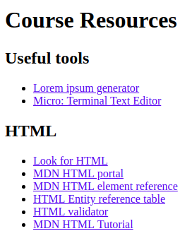
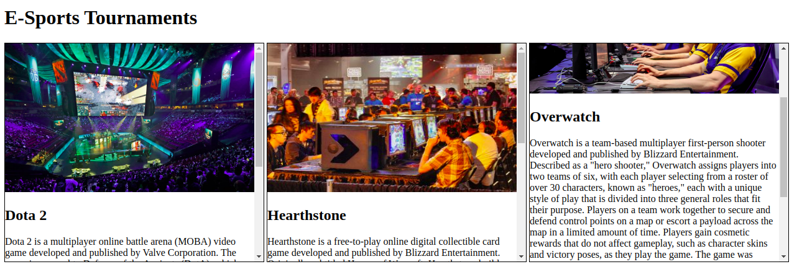
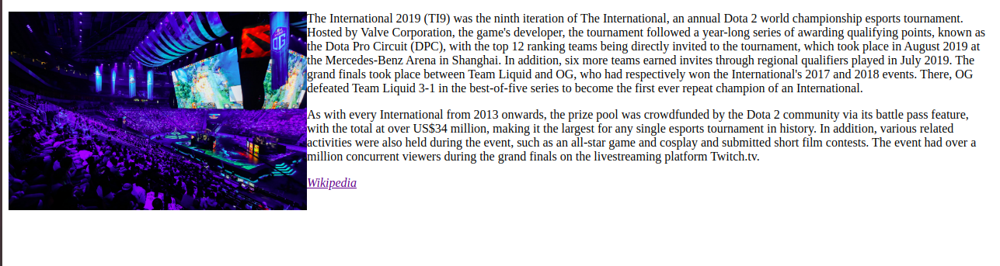

# Exercise Overview

[GitHub Classroom Test Exercise - 12.11.20](#github-classroom-test-exercise-12112020) <br>

[Boilerplate (and Then Some) - 16.11.20](#boilerplate-and-then-some-16112020) <br>

[UI Basics - Lists - 17.11.20](#boilerplate-and-then-some-16112020) <br>

[HTML Structure Worksheet - 17.11.20](#basic-structure) <br>

[Descendant Selectors - 17.11.20](#css-descendant-selectors) <br>

[Wikipedia-page-Exercise - 17.11.20](#wikipedia-page-exercise) <br>

[You've got class - 19.11.20](#youve-got-class) <br>

[How about ID'S? - 19.11.20](#how-about-ids) <br>

[External Links - 23.11.20](#exercise-external-links) <br>

[Coloring Book - 23.11.20](#coloring-book) <br>

[Table Of Contents - 23.11.20](#exercise-table-of-contents) <br>

[LoVe-HAte - 24.11.20](#exercise-css-selectors-3) <br>

[Lemon Drizzle Recipe (My Solution) - 25.11.20](#lemon-drizzle-recipe) <br>

[Selectors 1 - 25.11.20](#exercise-css-selectors-1) <br>

[Recipe Book - 26.11.20](#recipe-book) <br>

[Beyonce's Publicist - 26.11.20](#exercise-beyonces-publicist) <br>

[Contain Yourself - 30.11.20](#contain-yourself) <br>

[they-see-me-scrolling - 30.11.20](#they-see-me-scrolling) <br>

<hr>

# GitHub Classroom Test Exercise (12.11.2020)

Let's do a little exercise to practice the GitHub Classroom workflow. The task itself is not meant to be challenging. :wink:

## Workflow Steps

1. **Clone** your personal exercise repository.
2. Inside, switch to a **working branch** (e.g., `solution`) where you will solve the exercise.
3. Work on the task...
4. When you are done, push your solution branch to GitHub.
5. On GitHub, create a **pull request** and assign me as a reviewer.
6. I will review you pull request and, if required, add some comments.
7. If you solved the exercise, I will accept the pull request and merge into master.
8. If there are any problems, I will request changes and add some notes.
9. After a while, I will give you a link where you can inspect the official solution.
10. We can discuss challenging exercises during the next recap.

## Test Task

1. Create a `solution.md` markdown file, and add the title of your favorite scifi book, movie, or TV show, together with a cover image.

<br>

## Solution

### Mr. Robot


[back to Top](#exercise-overview)

<hr>

# Boilerplate (and Then Some) (16.11.2020)

## Instructions

- Create an HTML file.
- Just this once, please **don't** use Emmet.
- In the file, declare the document type and add the root element.
- Nested in the root element, add a head element and a body element.
- In the head element, create a meta tag for charset and author. Add your name to the author tag.
- Add a title in the meta tag and give your document a title.
- In the body, add a heading and two paragraphs.
- Comment out the second paragraph so it won't be displayed in the browser.

Please use our GitHub Classroom workflow: working branch => pull request

## Solution

```<!DOCTYPE html>
<html lang="en">
  <head>
    <meta charset="UTF-8" />
    <meta name="author" content="Alexey" />
    <title>This is title</title>
  </head>
  <body>
    <h1>This is heading</h1>

    <p>This is a paragraph</p>
    <!-- <p>This is also a paragraph</p> -->

  </body>
</html>
```

[back to Top](#exercise-overview)

# UI Basics

## Lists

**Instructions**:

- Add the basic html structure in carrot-cake.html. Include all required tags for HTML documents
- Add list tags to the recipe so the ingredients and steps are displayed in a nice way
- For ingredients create a list in which the order of items is not important
- For the steps (Method) create a list that conveys the order of the steps

**Bonus**:

- Add some styling to the lists you created: Using descendant combinators, make the unordered list display squares, and the ordered list display roman numerals.

# Solution:

[carrot-cake.html](html/carrot-cake.html) <br>
[stylesI.css](css/stylesI.css)


[back to Top](#exercise-overview)

<hr>

# Basic Structure

## Exercise I:

- Create a file named `index.html`.
- Create a basic html structure as shown in the following image (please create the file by typing):


- Change the name in the author meta to your name.

---

## Exercise II:

- For each of the lines in the `<body>`, wrap it in the appropriate heading

---

## Exercise III:

- For each heading add a **hover tooltip** that displays which element it is

---

## Exercise IV:

- Add a comment to explain each html element in the document

---

## Exercise V:

- For each heading add a paragraph below it, with any text you would like, and add a comment to the first `<p>` tag explain what it is.

---

## Exercise VI:

- Add the text from the following [file](/assets/logo.txt) into your html page so that it looks **exactly** like it does in the file. <br><br>

# Solutiton:

[index.html file](html/index.html)


[back to Top](#exercise-overview)

<hr>

# CSS Descendant Selectors

**Instructions**:

1. Modify the given page to make it look like the mockup.

Here is the mockup picture:


# Solution:

[index1.html](html/index1.html) <br>
[styles1.css](css/stylesI.css) <br>

[back to Top](#exercise-overview)

<hr>

# Wikipedia-Page-Exercise

1. Open your favorite Wikipedia Article
2. Turn it into a HTML webpage with correct headings and paragraphs where its appropriate
3. See the example image for how it should look like.


# Solution:

[wiki_exercise.html](html/wiki-exercise.html) <br>

[back to Top](#exercise-overview)

<hr>

# You've got class!

**Instructions**:

- Change the color of all list items with a class of "list-item".
- Change the color of all headings with the class of "heading".
- Change the background color of the element with an id.

**Bonus**: Add an id to another element and change the background color and change the opacity of the background color.

 <br>

<hr>

# Solution

[solution.html](/html/solution.html) <br>
[stylesI.css](css/stylesI.css) <br>

[back to Top](#exercise-overview)

<br>

# UI-Basics-Content-Classes&IDs

# How about ID'S?

**Instructions**:

- Modify either the classes or Id's in the HTML file and add or change the corresponding classes and Id's in the CSS file that you have for this exercise to make sure the text of the whole page is only in color blue.


**Bonus**:

- Separate the p tags in different DIVs.
- Give either an ID or a class to each DIV.
- Add a background color to each DIV.

# Solution:

[index3.html](html/index3.html) <br>
[stylesI.css](css/stylesI.css) <br>

[back to Top](#exercise-overview)

<br>

<hr>

# Basic HTML Exercises

## Exercise: External Links

**Instructions**:

Mark the text in the HTML file so that you will have a page with:

1. One main title:

   - Course resources

2. Two secondary titles

   - Useful tools
   - HTML

3. Two lists of links under the secondary titles.

Below, add a heading for "Contact", and a link that creates an e-mail. That email link should have the default subject "Contact – Course Resources".

**Note**:

- The actual URL should **not** show on the page.
- The link should open in a new tab.



# Solution:

[external-links](html/index4.html) <br>

[back to Top](#exercise-overview)

<hr>

# Coloring Book

**Instructions**:

- Style each of the headings with the colors described in the heading.
- Once you're finished, add alpha to each of the headings using `rgba`.
- Then select all the paragraphs and add a hex color.


# Solution

[index5.html](html/index5.html) <br>
[styles2.css](css/styles2.css) <br>

[back to Top](#exercise-overview)

<br>

<hr>

# Basic HTML Exercises

## Exercise: Table Of Contents

**Instructions**:

1. Add a unique id to each heading tag in the page, make the id as descriptive as possible.

2. Wrap the text in the table of contents in an ordered list so that each main heading and its sub headings are in the same list.

3. In each list item under the main heading text, add another **nested** ordered list so that each sub heading is wrapped in a list item.

4. For each of the list items in the table of contents, add an anchor link that wraps around the text. when the link is clicked, the page should scroll to that heading.

5. At the end of each section in the text, before the next sub heading, add a "Back to top" link, that scrolls the page back to the top.

6. Change the nested list numbering to roman numerals.

# Solution:

[index6.html](html/index6.html) <br>
[styles3.css](css/styles3.css) <br>

[back to Top](#exercise-overview)

<hr>

# Exercise: CSS Selectors 3

**Instructions**:

1. Add a link/visited/hover/active state to all the links in the article.

2. Add a hover and active state to the buttons at the bottom of the page.

**Bonus Tasks**: 3. Change the color of the first letter of each paragraph. 4. Change the color of the first line of the paragraphs which immediately follow h2 elements. HINT: Use a combinator!

# Solution:

[index7.html](html/index7.html) <br>
[styles4.css](css/styles4.css) <br>

[back to Top](#exercise-overview)

<hr>

# Lemon Drizzle Recipe

Single webpage about Lemon Drizzle Slices Recipe

## Instructions

- Add favicon in head of document
- Add a title to the document
- You can get text content from `content.txt` file
- Link should be opened in new tab
- on `:hover` color will be changed to **green**
- Please just code what you see, neither less nor more.

## The desktop overview


## The online version

In order to see live version, just [click...!](https://hsnakk.github.io/UIB_Content_Exercise-2/)

## My Solutiton:

[index8.html](html/index8.html) <br>
[styles5.css](css/styles5.css) <br>

## Solution:

[index10.html](html/index10.html) <br>
[styles6.css](css/styles6.css) <br>

[back to Top](#exercise-overview)

<hr>

# Basic CSS Exercises

## Exercise: CSS Selectors 1

**Instructions**:

1. Select all h3 elements and change the elements' color to blue.
2. Select list items 3-5 in task 2 using classes. Change the elements' color to red.
3. Select the sibling of the first image using a combinator. Give the image a border.
4. Select the link ending in .com with an attribute selector. Give it a yellow background color.
5. Give "Task 5" (_this_) list item an id and change the color of the text.


## My Solution (identical with Alex's solution):

[index9.html](html/index9.html) <br>
[main.css](css/main.css) <br>

[Back to Top](#exercise-overview)

# Recipe Book

## Exercise I

- [x] In the `recipes` folder, create a new file with the basic html structure, with the following naming convention `index.html`.
- [x] Create a meta tag with the name author and your name as the value.
- [x] Change the title of the page to the name of the recipe.

---

## Exercise II

- [x] Find and/or download an image for your recipe, and put it in the `img` folder.
- [x] Add the image of your recipe to the html page, the fallback text for the image should be the name of the recipe, the image must be 500 px wide

---

## Exercise III

- [x] Under the image, add the main heading of your page. The heading should be the name of your recipe.
- [x] Add two secondary headings to your page. The first should say "Ingredients" and the second should say "Preparation".

---

## Exercise IV

- [x] Under the "Ingredients" heading, add an unordered list for the ingredients of your recipe
- [x] Under the "Preparation" heading, add an ordered list for the preparation of your recipe


# Solution:

[index11.html](html/index11.html) <br>

[back to Top](#exercise-overview)

<hr>

# Exercise: Beyonce's Publicist

**Instructions**:

Beyonce's publicist hired you to create a social media link list for Beyonce herself! Your faithful designer has quickly created these little social media icons for you and put them online. All you need to do now is create a series of icons that link to all of Beyonce's social media profiles.

1. Use the list of resources in the HTML file to create an unordered list of image links that contains a link to each of the social media profiles. Each link should open in a new tab.

2. Add a hover tooltip to each of the links with Beyonce's username on each of the social media platforms.

3. Make sure that there are no points before the list items.

## Solution:

[index12.html](html/index12.html) <br>
[styles7.css](css/styles7.css) <br>

[back to Top](#exercise-overview)

<hr>

# Contain Yourself

**Instructions**:

- Style the header so that is takes up 100% of the viewport height.
- Add the `container.jpg` image from the [images folder](./images/) to the `img` tag found in the header.
- Style the image to take up 100% width and height of the header.
- **BONUS:** Use `object-fit` to preserve the image's aspect ratio.
  
- Give the `main` element a class of `container`.
- Select the `container` class. Give it a width of 80% and center it in the middle of the page.
  
- **BONUS:** Choose a font from google fonts and apply it to the page.

## Solution:

[index.html](html/index.html) <br>
[style.css](css/style.css) <br>

[To Top](#exercise-overview)

<hr>

# They see me scrolling

**Instructions**:
**Task 1**

- The sections with the class `esports-info` need to be styled.
- First of all, give each section a set height and width.
- Give each section a border.
- Set the size of the images.
- Allow the user to scroll through the information on each section.
  

**Task 2**

- Make the image and paragraphs in the section with the class `esports-tournaments` appear side-by-side using float.
  


## Solution:

[indexI.html](html/indexI.html) <br>
[styleI.css](css/styleI.css) <br>

[To Top](#exercise-overview)

<hr>
