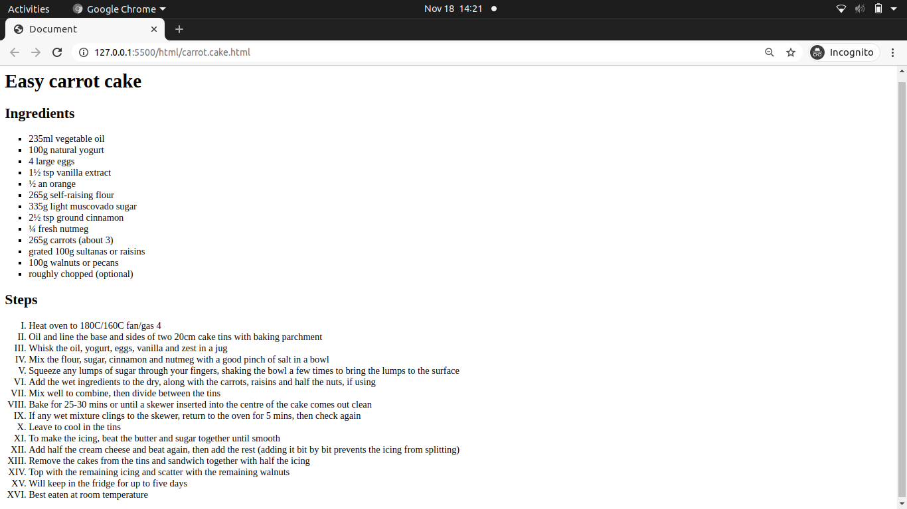
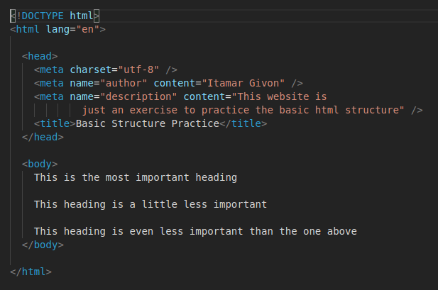
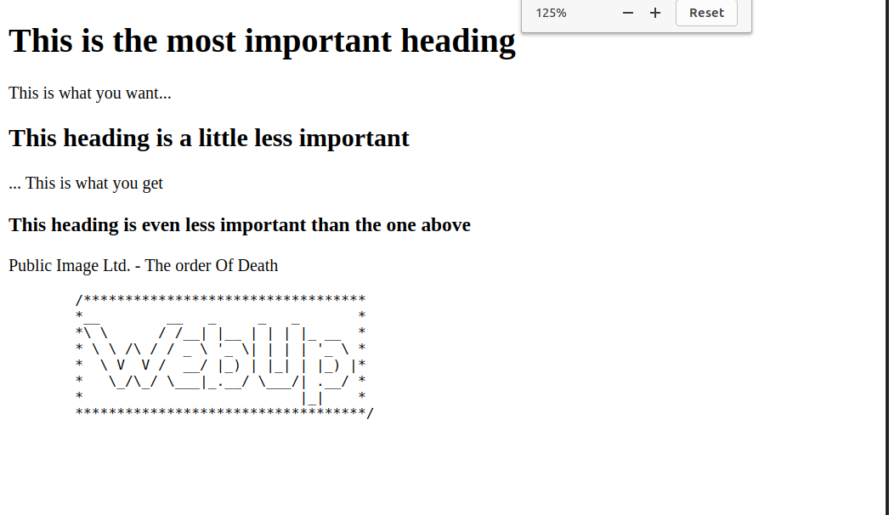

# GitHub Classroom Test Exercise (12.11.2020)

Let's do a little exercise to practice the GitHub Classroom workflow. The task itself is not meant to be challenging. :wink:

## Workflow Steps

1. **Clone** your personal exercise repository.
2. Inside, switch to a **working branch** (e.g., `solution`) where you will solve the exercise.
3. Work on the task...
4. When you are done, push your solution branch to GitHub.
5. On GitHub, create a **pull request** and assign me as a reviewer.
6. I will review you pull request and, if required, add some comments.
7. If you solved the exercise, I will accept the pull request and merge into master.
8. If there are any problems, I will request changes and add some notes.
9. After a while, I will give you a link where you can inspect the official solution.
10. We can discuss challenging exercises during the next recap.

## Test Task

1. Create a `solution.md` markdown file, and add the title of your favorite scifi book, movie, or TV show, together with a cover image.

<br>

## Solution

### Mr. Robot


<hr>

# Boilerplate (and Then Some) (16.11.2020)

## Instructions

- Create an HTML file.
- Just this once, please **don't** use Emmet.
- In the file, declare the document type and add the root element.
- Nested in the root element, add a head element and a body element.
- In the head element, create a meta tag for charset and author. Add your name to the author tag.
- Add a title in the meta tag and give your document a title.
- In the body, add a heading and two paragraphs.
- Comment out the second paragraph so it won't be displayed in the browser.

Please use our GitHub Classroom workflow: working branch => pull request

## Solution

```<!DOCTYPE html>
<html lang="en">
  <head>
    <meta charset="UTF-8" />
    <meta name="author" content="Alexey" />
    <title>This is title</title>
  </head>
  <body>
    <h1>This is heading</h1>

    <p>This is a paragraph</p>
    <!-- <p>This is also a paragraph</p> -->

  </body>
</html>
```

# UI Basics

## Lists

**Instructions**:

- Add the basic html structure in carrot-cake.html. Include all required tags for HTML documents
- Add list tags to the recipe so the ingredients and steps are displayed in a nice way
- For ingredients create a list in which the order of items is not important
- For the steps (Method) create a list that conveys the order of the steps

**Bonus**:

- Add some styling to the lists you created: Using descendant combinators, make the unordered list display squares, and the ordered list display roman numerals.

[carrot-cake.html](html/carrot-cake.html) <br>
[stylesI.css](css/stylesI.css)



<hr>

# Basic Structure

## Exercise I:

- Create a file named `index.html`.
- Create a basic html structure as shown in the following image (please create the file by typing):



- Change the name in the author meta to your name.

---

## Exercise II:

- For each of the lines in the `<body>`, wrap it in the appropriate heading

---

## Exercise III:

- For each heading add a **hover tooltip** that displays which element it is

---

## Exercise IV:

- Add a comment to explain each html element in the document

---

## Exercise V:

- For each heading add a paragraph below it, with any text you would like, and add a comment to the first `<p>` tag explain what it is.

---

## Exercise VI:

- Add the text from the following [file](/assets/logo.txt) into your html page so that it looks **exactly** like it does in the file. <br><br>

# Solutiton

[index.html file](html/index.html)



<hr>

# Basic CSS Exercises

## Exercise: CSS Descendant Selectors

**Instructions**:

1. Modify the given page to make it look like the mockup.

Here is the mockup picture:


# Solution

Here are the files:

[index1.html](html/index1.html) <br>
[styles1.css](css/stylesI.css) <br>

<hr>

# UIB-content-text

1. Open your favorite Wikipedia Article
2. Turn it into a HTML webpage with correct headings and paragraphs where its appropriate
3. See the example image for how it should look like.


# Solution

[wiki_exercise.html](html/wiki-exercise.html) <br>

<hr>

# You've got class!

**Instructions**:

- Change the color of all list items with a class of "list-item".
- Change the color of all headings with the class of "heading".
- Change the background color of the element with an id.

**Bonus**: Add an id to another element and change the background color and change the opacity of the background color.

 <br>

<hr>

# Solution

[solution.html](/html/solution.html) <br>
[stylesI.css](css/stylesI.css)

# UI-Basics-Content-Classes&IDs

# How about ID'S?

**Instructions**:

- Modify either the classes or Id's in the HTML file and add or change the corresponding classes and Id's in the CSS file that you have for this exercise to make sure the text of the whole page is only in color blue.


**Bonus**:

- Separate the p tags in different DIVs.
- Give either an ID or a class to each DIV.
- Add a background color to each DIV.

# Solution

[index3.html](html/index3.html) <br>
[stylesI.css](css/stylesI.css) <br>

<hr>

# Basic HTML Exercises

## Exercise: External Links

**Instructions**:

Mark the text in the HTML file so that you will have a page with:

1. One main title:

   - Course resources

2. Two secondary titles

   - Useful tools
   - HTML

3. Two lists of links under the secondary titles.

Below, add a heading for "Contact", and a link that creates an e-mail. That email link should have the default subject "Contact – Course Resources".

**Note**:

- The actual URL should **not** show on the page.
- The link should open in a new tab.


# Solution

[external-links](html/index4.html)

<hr>

# Coloring Book

**Instructions**:

- Style each of the headings with the colors described in the heading.
- Once you're finished, add alpha to each of the headings using `rgba`.
- Then select all the paragraphs and add a hex color.


# Solution

[index5.html](html/index5.html) <br>
[styles2.css](css/styles2.css) <br>

<hr>

# Basic HTML Exercises

## Exercise: Table Of Contents

**Instructions**:

1. Add a unique id to each heading tag in the page, make the id as descriptive as possible.

2. Wrap the text in the table of contents in an ordered list so that each main heading and its sub headings are in the same list.

3. In each list item under the main heading text, add another **nested** ordered list so that each sub heading is wrapped in a list item.

4. For each of the list items in the table of contents, add an anchor link that wraps around the text. when the link is clicked, the page should scroll to that heading.

5. At the end of each section in the text, before the next sub heading, add a "Back to top" link, that scrolls the page back to the top.

6. Change the nested list numbering to roman numerals.

# Solution:

[index6.html](html/index6.html) <br>
[styles3.css](css/styles3.css) <br>

<hr>

# Basic CSS Exercises

## Exercise: CSS Selectors 3

**Instructions**:

1. Add a link/visited/hover/active state to all the links in the article.

2. Add a hover and active state to the buttons at the bottom of the page.

**Bonus Tasks**: 3. Change the color of the first letter of each paragraph. 4. Change the color of the first line of the paragraphs which immediately follow h2 elements. HINT: Use a combinator!

# Solution:

[index7.html](html/index7.html) <br>
[styles4.css](css/styles4.css) <br>

<hr>
